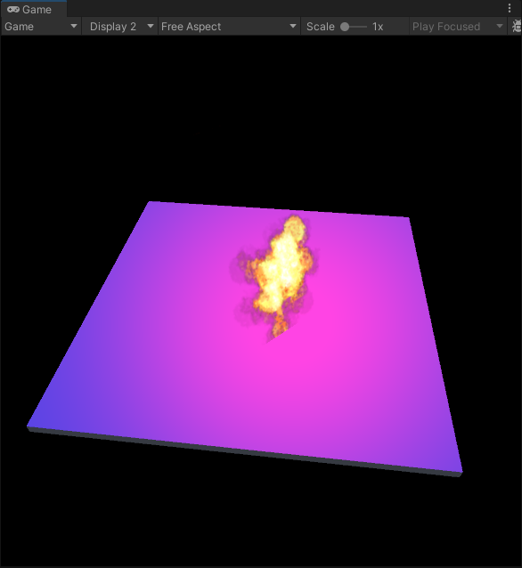
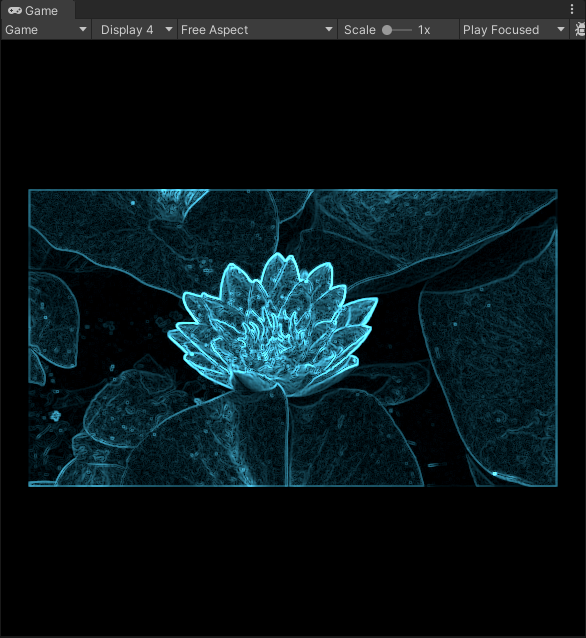
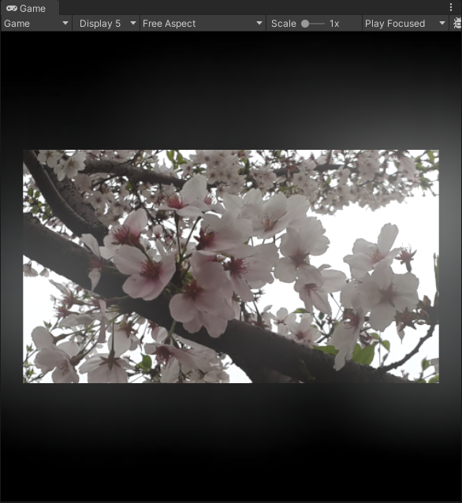

# Shader
#### 0-1 Shader

## CamRes:

#### Default Shader:

####  

#### Default ShaderLab:

#### 

#### Random Bubbles:

####  

#### Voronoise:

####  

#### Laser:

#### 

## ObjRes:

#### DiffuseVertex:

#### 

#### DiffusePixel:

#### 

#### DiffuseHalfLambert:

#### 

#### SpecularVetex:

#### 

#### SpecularPixel:

#### 

#### SpecularBlinnPhong:

#### 

#### SingleTexture:

#### 

#### NormalMapTangentSpace:

#### 

#### NormalMapWorldSpace:

#### 

#### RampTexture:

#### 

#### MaskTexture:

#### 

#### AlphaTest:

#### 

#### AlphaBlend:

#### 

#### AlphaBlendZWrite:

#### 

#### AlphaTestBothSided:

#### 

#### AlphaBlendBothSided:

#### 

#### ForwardRenderingMat:

#### 

#### Shadow_Attenuation:

#### 

#### TeapotReflection:

#### 

#### TeapotRefraction:

#### 

#### TeapotFresnel:

#### 

#### Mirror:

#### 

#### GlassRefractionMat:

#### 

#### ProcedrualTexture:

#### 

#### ImageSequenceAnimation:

#### 

#### ScrollingBackground:

#### 

#### WaterWave:

#### 

#### StarBillboard:

#### 

#### Brightness_Saturation_Contrast:

#### 

#### Sobel_EdgeDetection:

#### 

#### 

#### GaussianBlur:

#### 

#### Bloom:

#### 

#### MotionBlur:

#### 
